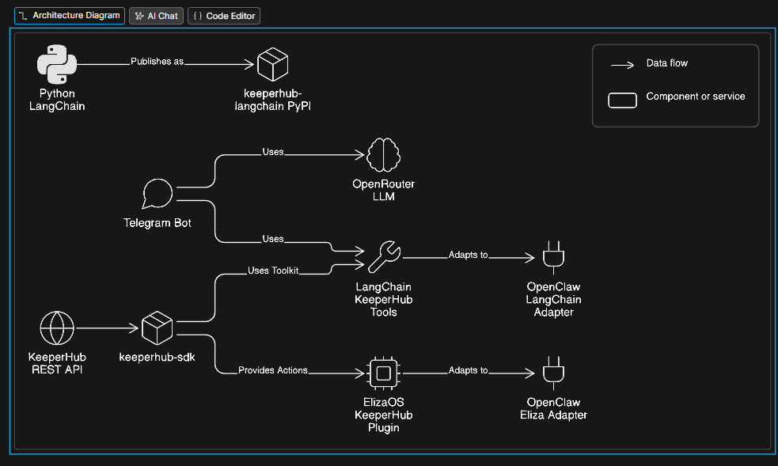

# KeeperHub Agent SDK



> The complete SDK for building AI agents that execute onchain — Python, TypeScript, ElizaOS, OpenClaw, and Hermes.

Built for the **ETHGlobal OpenAgents Hackathon** · Runs on real Base mainnet · 5 frameworks · 25+ tools · 19 chains

---

## Quick Install (Pick One)

### 🦞 1. OpenClaw (NO CODE — fastest demo)
```bash
npm install -g openclaw
openclaw plugin install @ethglobal-openagent/openclaw-keeperhub
openclaw
```
👉 **Docs:** [OpenClaw Adapter](./docs/openclaw)

Optional (Eliza tools inside OpenClaw):
```bash
openclaw plugin install @ethglobal-openagent/openclaw-eliza-keeperhub
```

### 🟦 2. TypeScript (LangChain)
```bash
npm install @ethglobal-openagent/langchain-keeperhub @langchain/openai @langchain/langgraph
```
👉 **Docs:** [TypeScript LangChain](./docs/ts-langchain)

### 🐍 3. Python (LangChain)
```bash
pip install keeperhub-langchain langchain-openai langgraph
```
👉 **Docs:** [Python LangChain](./docs/python-langchain)

### 🟣 4. ElizaOS
```bash
npm install @ethglobal-openagent/elizaos-keeperhub @elizaos/core
```
👉 **Docs:** [ElizaOS Plugin](./docs/elizaos)

### ⚙️ 5. Core SDK (direct API)
```bash
npm install keeperhub-sdk
```
👉 **Docs:** [KeeperHub SDK](./docs/sdk)

---

## Set Up Your Agent in 5 Minutes

Set two env vars:

```bash
export KEEPERHUB_API_KEY=kh_...      # app.keeperhub.com → Settings → API Keys
export OPENROUTER_API_KEY=sk-or-...  # openrouter.ai — free models available
```

---

## What Is This?

KeeperHub is an onchain automation platform with 396 DeFi actions across 19 blockchains. This repo is the **multi-framework agent SDK** that makes KeeperHub accessible to every major AI agent framework.

**Now it's 3 lines:**

```python
from langchain_keeperhub import KeeperHubToolkit
toolkit = KeeperHubToolkit()
tools = toolkit.get_tools()  # 24 tools, ready to use
```

---

## Packages

| Package | Registry | Tools/Actions | Language | Docs |
|---------|-----------|---------------|----------|------|
| `keeperhub-langchain` | [PyPI](https://pypi.org/project/keeperhub-langchain/) | 24 tools | Python | [python-langchain/](./docs/python-langchain) |
| `@ethglobal-openagent/langchain-keeperhub` | [npm](https://www.npmjs.com/package/@ethglobal-openagent/langchain-keeperhub) | 25 tools | TypeScript | [ts-langchain/](./docs/ts-langchain) |
| `@ethglobal-openagent/elizaos-keeperhub` | [npm](https://www.npmjs.com/package/@ethglobal-openagent/elizaos-keeperhub) | 17 actions | TypeScript | [elizaos/](./docs/elizaos) |
| `@ethglobal-openagent/openclaw-keeperhub` | [npm](https://www.npmjs.com/package/@ethglobal-openagent/openclaw-keeperhub) | 25 tools | TypeScript | [openclaw/](./docs/openclaw) |
| `@ethglobal-openagent/openclaw-eliza-keeperhub` | [npm](https://www.npmjs.com/package/@ethglobal-openagent/openclaw-eliza-keeperhub) | 17 actions | TypeScript | [openclaw/](./docs/openclaw) |
| `keeperhub-sdk` | [npm](https://www.npmjs.com/package/keeperhub-sdk) | Core API | TypeScript | [sdk/](./docs/sdk) |

👉 **Full architecture:** [Architecture Overview](./docs/architecture.md)

---

## Features

### Safety Guardrails
```typescript
const toolkit = new KeeperHubToolkit({
  apiKey: process.env.KEEPERHUB_API_KEY!,
  testnetOnly: true,                    // Block all mainnet writes
  allowedChainIds: [11155111, 84532],  // Restrict to specific chains
});
```
Available in all SDK packages.

### x402 / MPP Autonomous Payments
Agents can discover paid workflows, check wallet balance, and pay autonomously via x402 (Base USDC) or MPP (Tempo USDC.e).

### ERC-8004 Agent Identity
Register agents on-chain — mints an identity NFT representing the agent.

### ENS Resolution
Resolve ENS names to addresses and vice versa.

👉 **Full feature docs:** [TypeScript LangChain Tools](./docs/ts-langchain) | [Python LangChain Tools](./docs/python-langchain)

---

## Hermes

Used with MCP-compatible agents. **Not a standalone runtime.**

Set up via the KeeperHub SDK's MCP module:
```bash
export KEEPERHUB_API_KEY=kh_...
# Hermes reads packages/hermes-skill/SKILL.md and connects to KH MCP automatically
```

👉 **MCP Docs:** [SDK MCP Module](./docs/sdk/modules/mcp.md)

---

## Supported Chains (19)

Ethereum, Base, Arbitrum, Optimism, Polygon, Avalanche, BNB Chain, and their testnets.

👉 **Full chain list:** [KeeperHub Chains](./docs/sdk/modules/chains.md)

---

## 🤖 Telegram Bot

We built a live Telegram agent powered by the same SDK:

👉 https://t.me/khethworkbot

Interact with KeeperHub tools directly via chat — check balances, transfer funds, resolve ENS names, and execute DeFi actions in plain English.

👉 **Bot docs:** [Telegram Bot](./docs/telegram-bot)

---

## Links

- **GitHub:** https://github.com/dhruv457457/keeperhub-eth-global
- **KeeperHub platform:** https://app.keeperhub.com
- **API docs:** https://app.keeperhub.com/api/openapi
- **Architecture:** [Architecture Overview](./docs/architecture.md)

---

## License

Apache-2.0 · Built for ETHGlobal OpenAgents Hackathon 2026
